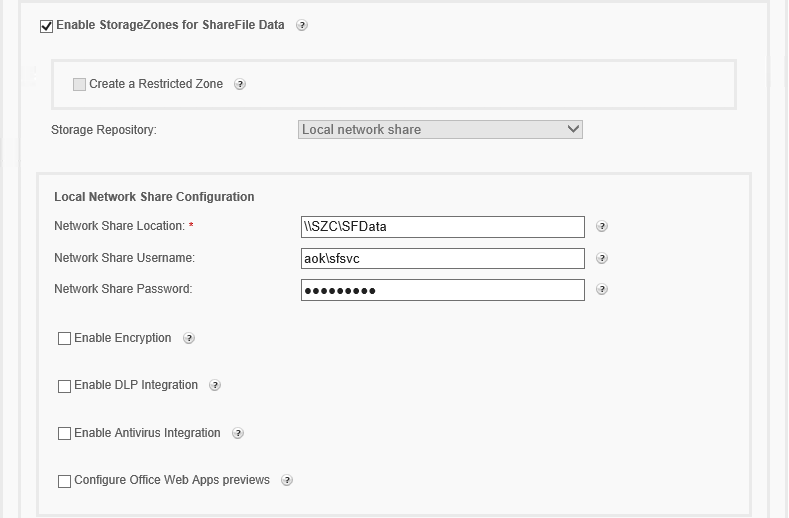
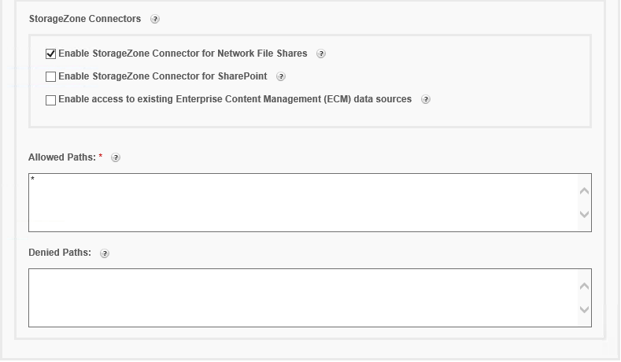
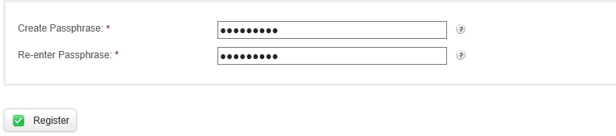
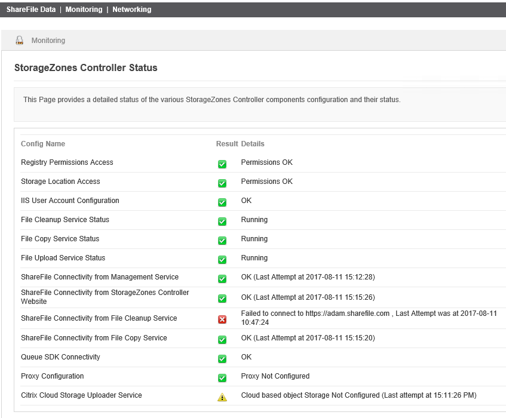
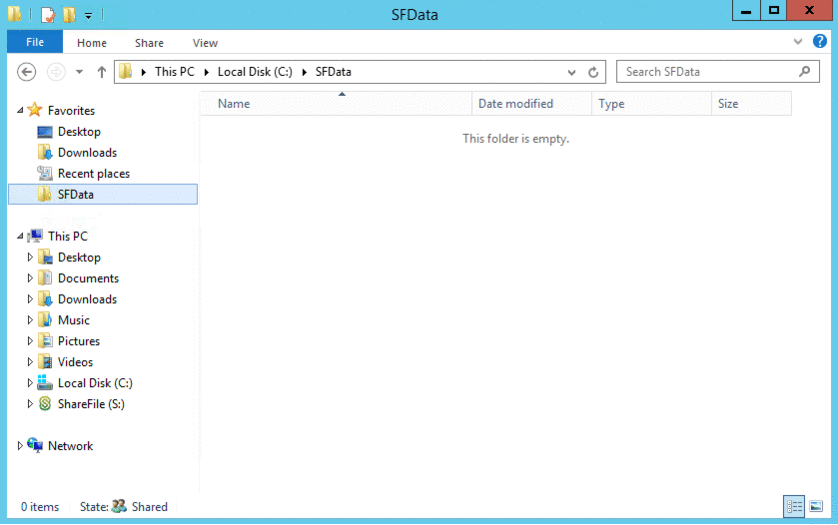

# Module 1: Installing and Configuring an on-premises ShareFile StorageZone

When configuring an on-premises StorageZone it is best to first have all pre-requisites in place before starting the installation. The following is the pre-requisites list:

* A dedicated physical or virtual machine with 2 CPUs and 4 GB RAM
    * Windows Server
    * Windows Server 2012 R2 (Datacenter, Standard, or Essentials)
    * Windows Server 2008 R2, 64-bit edition, SP1 (Datacenter, Standard, or Essentials)
* A publicy resolvable Fully Qualified Domain Name
* Enable SSL for communication with ShareFile
* A public SSL certificate
* Allow inbound TCP requests on 443 through your firewall
* Allow outbound TCP requests to the ShareFile Application on port 443 through your firewall

## Preparing your VM for StorageZones Controller 

Open a session to the Virtual Machine you will be using as your StorageZones Controller. 

### Downloading the software

Navigate to the [ShareFile downloads page](https://www.citrix.com/downloads/sharefile/) on the Citrix site and download the latest version of ShareFile StorageZones Controller to your VM.

### Creating the ShareFile Data network file share

Create a new network file share and give Full Control to a ShareFile service account and take note of the UNC path. This share will be dedicated to ShareFile Data *only* and will not be directly accessible to users over the network. Instead, when users make upload and download requests the StorageZone will read or write files to a persistent storage location using the service account on behalf of the user. It is best to host this network file share on a file server where storage can be expanded as needed.

### Installing the required Roles & Features

On your StorageZones Controller VM open **Server Manager** and select **Add Roles and Features**.

In the _Add Roles and Features_ wizard add the **Web Server (IIS)** role.

In the Features section, expand *.NET Framework 4.5 Features > WCF Services* and check the box **HTTP Activation**. This will install the required .NET 4.5 Framework required by the StorageZones Controller to do it's job.

Finally, in the _Role Services section_ under _Security_ enable both **Basic Authentication** and **Windows Authentication**. This enables support for StorageZones Connectors allowing your users to browse existing data repositories like network file shares, SharePoint, and Content Management Systems. Finish the wizard to complete the *required* preparation work.

### Binding the public SSL certificate in IIS Manager

In IIS, if you bind your public SSL certificate to 443 you can pass encrypted ShareFile traffic from the public internet directly to the StorageZones Controller.

More stringent security practices dictate a network appliance in the DMZ, such as a NetScaler, proxying inbound traffic to the StorageZones Controller. In the case where the StorageZones Controllers are front-ended by a network appliance you would install the public SSL certificate on the appliance and would at that point have the option of passing traffic between it and the StorageZones Controller encrypted or unencrypted.

## Installing and configuring StorageZones Controller

Run the StorageCenter software that you downloaded earlier and complete the installation in the default location. Click **Finish** when completed. It is generally *not* necessary to reboot your VM after completing installation.

Navigate to [http://localhost/ConfigService/login.aspx](http://localhost/ConfigService/login.aspx) and log in using your ShareFile administrator credentials.

### Configuring the StorageZone

On the configuration page select to **Create new Zone** and in the top field immediately to the right type a "friendly" name for your StorageZone such as *Private Zone*.

For **External Address** enter the *public Fully Qualified Domain Name* you are using for your StorageZone (e.g.: myzone1.acme.com)

Check the box to **Enabe StorageZones for ShareFile Data** (ShareFile's "native" data format) 

Check the box to **Enable StorageZone Connector for Network File Shares**.

As you check the boxes above You will notice the page expand with additional fields for configuring both Sharefile Data and Connectors.

Scroll down to the *Sharefile Data* section.

In the **Network Share Location** field enter the UNC path to the network file share you created earlier (e.g.: **\\\SZC\SFData**)

In the **Network Share Username** enter the service account you gave Full Control on the share. Use the format **DOMAIN\username**

Enter the password for the ShareFile service account.

For this lab we will be leaving the remaining boxes in the ShareFile Data section unchecked but take note of the remaining options…

* [Create Restricted Zone](https://docs.citrix.com/en-us/storagezones-controller/4-0/restricted-storagezones.html) -- Encrypts file metadata in the ShareFile Control Plan but limits access to domain (employee) users.
* [Enable Encryption](https://docs.citrix.com/en-us/storagezones-controller/5-0/install/controller.html) -- The StorageZone encrypts Sharefile Data as it is written to persistent storage. Generally unnecessary for customers who are already storing data in a secure environment.
* [Enable DLP Integration](https://docs.citrix.com/en-us/storagezones-controller/5-0/data-loss-prevention.html) -- Leverages ICAP protocol to scan uploaded files with customer's existing DLP software. 
* [Enable Antivirus Integration](http://docs.citrix.com/en-us/storagezones-controller/5-0/manage-storagezone-controllers/antivirus-scans.html) -- Leverages ICAP protocol to scan files for malware.
* [Configure Office Web Apps](http://docs.citrix.com/en-us/storagezones-controller/4-0/sf-install-storagezones/configure-storagezones-controller-for-web-app-previews--thumbnai.html) -- Support for viewing and editing office documents using an on-premises Microsoft Office Web Apps environment.

> Recall that ShareFile Data is ShareFile's native data storage. As such, ShareFile stores uploaded files as data objects and then references those data objects through an abstraction layer (users interface with a ShareFile client application such as the web, mobile, or desktop apps. The ShareFile clients then make API requests to the ShareFile Control Plane, which in turn broker file transfer between the client and the StorageZone.

Scroll down to the *StorageZone Connectors* section of the configuration page.

For this lab we are only enabling *Connectors for Network File Shares* but note that you may enable access to other data repositories hosted in your environments such as *SharePoint Libraries* and *Enterprise Content Management (ECM) systems*.

Notice the two additional fields, **Allowed Paths** and **Denied Paths**, where you may whitelist and blacklist access to specific shares and sites. By default the Allowed Paths contains a wildcard (*) symbol which enables access to all data respositories.

When you have finished configuration scroll to the bottom of the page and enter a secure *passphrase* twice. When you register the StorageZone you an *encryption key* will be generated and stored in the *SCKeys.txt* file in your Sharefile Data network file share.

> You should archive the passphrase and encryption key in a secure location.
You must use the same passphrase for each StorageZones Controller in a zone. The passphrase is not the same as your ShareFile account password and cannot be recovered if lost. 

> If you lose the passphrase, you cannot reinstall StorageZones, join additional StorageZones Controllers to the StorageZone, or recover the StorageZone if the server fails.

> Losing the encryption key file, *SCKeys.txt*, immediately breaks access to all StorageZone files. Be sure to back up the encryption key file as part of your normal datacenter procedures.

Click **Register**. The page will refresh and you should see a success message at the top of the page.

### Checking the StorageZones Controller status

Click on the Monitoring tab at the top of the configuration page and make sure you see green checkboxes all the way down (except for the Citrix Cloud Uploader Service, which should have a yellow warning triangle). If one of the services shows a red box with an "X" open the *Services* Administrative Tool and restart the appropriate Citrix ShareFile service.

Navigate to the ShareFile Data network file share you created earlier and notice that it has been populated with files and folders. Note the SCKeys.txt file. Uploaded files  will be stored in the *persistentstorage* folder.

Open a local browser, navigate to your ShareFile account (e.g.: [https://your-subdomain.sharefile.com](https://your-subdomain.sharefile.com)), and login in with your ShareFile Admin credentials. Click on *Settings > Admin Settings > StorageZones*. This area provides an overview of all available StorageZones on your account, whether they are on the Citrix-managed cloud, or customer-managed on-premises or cloud. The StorageZone will provides its health status and clicking on the name of your StorageZone will provide status on each of the individual StorageZones Controller hosts if you have configured your StorageZone with high availability. You can also see all folders and Connectors that reside on the Zone.

## Conclusion

Congratulations, you have finished configuring your StorageZone. However, uploads to the StorageZone will not work quite yet because inbound traffic to this StorageZone must first pass to a NetScaler. In [Module 2](../Module-2) you will configure the NetScaler to manage ShareFile traffic before passing it onto the StorageZones Controller.

## Shortcuts

1. [Introduction: Deploying an on-premises StorageZones Controller](/)
2. [Module 1: Installing and Configuring an on-premises ShareFile StorageZone](../Module-1)
3. [Module 2: Configuring NetScaler for an on-premises ShareFile StorageZone](../Module-2)
4. [Module 3: Using your on-premises StorageZone](../Module-3)