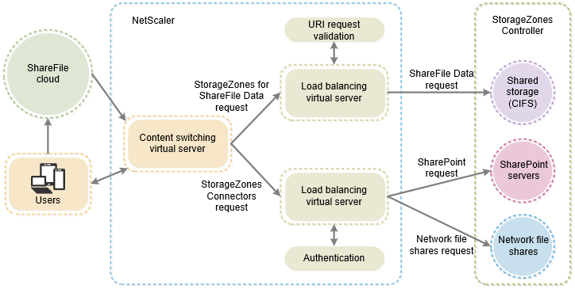
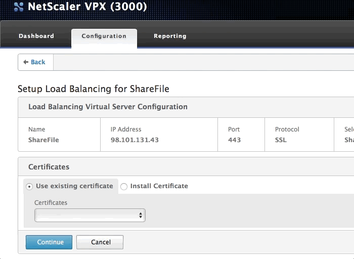
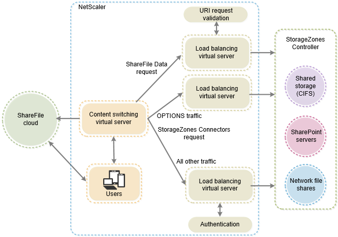

# Module 2: Configuring NetScaler for an on-premises ShareFile StorageZone

Configuring the NetScaler to manage and secure ShareFile traffic is made fairly straightforward with the ShareFile Wizard.

The chart below outlines the five features that ShareFile leverages NetScaler for managing traffic to a StorageZone, including their availability by NetScaler Edition.

|                   | Platinum Edition | Enterprise Edition | Standard Edition |
| :---              | :---:            | :---:              | :---:            |
| Load Balancing		| •                | •                  | •                |
| Responder Policy	| •                | •                  | •                |
| HTTP Callouts		| •                | •                  | •                |
| Content Switching | •                | •                  |                  |
| AAA					| •                | •                  |                  |

Content Switching and AAA are required to authenticate inbound user requests to StorageZone Connectors at the NetScaler before passing the request on to the internal network -- otherwise authentication traffic will be passed to the StorageZone 

## Configuring NetScaler for ShareFile basics

The ShareFile Wizard automates a secure configuration for managing inbound ShareFile requests when hosting an on-premises StorageZone.

1. The **Content Switching** virtual server receives all ShareFile requests directed at the public StorageZone FQDN. 
2. Content Switching policies direct traffic to one of two **Load Balancing** VIPs -- one for *ShareFile Data* and one for *StorageZones Connectors* for network file shares (CIFS) and SharePoint (SP).
	1. URI request validation takes place for requests coming into ShareFile Data, leveraging **HTTP Callouts**, which validates URI HMACs against the StorageZone Controller, and a **Responder Policy**, which drops non-valid traffic.
	2. A **AAA** virtual server bound to the Connectors Load Balancing VIP authenticates user requests for existing network resources at the NetScaler before passing them into the network.

### Completing the ShareFile Wizard

Log into the NetScaler management interface and navigate to the Configuration tab. Click on the **Traffic Management** section and select **Setup NetScaler for ShareFile**.

When asked to enter a *public IP address and a name for the content switching virtual server* enter the public IP address or DMZ IP address which will be the ingress point at the NetScaler for ShareFile StorageZone requests. you may leave the default name if you wish. 

Check the box for **StorageZones Connector for network file shares and SharePoint**. Click **Continue**. 

In the *Certificates* section select or install the required public SSL certificate for the StorageZone.

In the *ShareFile StorageZone Controller Configuration* section click on **Add New StorageZone Controller**. Enter the IP address for your StorageZone Controller host machine.

Select whether you would like the NetScaler to pass internal traffic between itself and the StorageZone Controllers encrypted (https over 443) or unencrypted (https over 443).

If you are encrypting traffic from the NetScaler to the StorageZone Controller you must have the SSL certificate installed on the StorageZone Controller and bound on 443 in IIS.

Next create an LDAP configuration so user StorageZones Connector requests to a **AAA Virtual Server IP Address** can be authenticated. The *AAA virtual server IP address* should *not* be in use elsewhere in your environment.

Finalize your configuration.

## Adding support for browsing Connectors from the web

To support web access to StorageZone Connectors, you must perform additional NetScaler configuration after you complete the ShareFile wizard.

In this section you will create and configure a third NetScaler load-balancing virtual server, used to ensure that ShareFile clients send credentials only when logged on to a trusted ShareFile domain.

> StorageZones Controller uses the Cross-Origin Resource Sharing (CORS) standard to provide the necessary security for requests to StorageZones and from the ShareFile web interface to browse Connectors. CORS uses HTTP headers to allow the client and server to know enough about each other to determine if a request or response should succeed.

### Adding an "OPTIONS" load balancing VIP

Navigate to *Load Balancing > Virtual Servers* and click **Add** to create a new LB VIP.

Name the LB VIP something like **SF_OPTIONS**. Set the **Protocol** to *SSL*. Set the **IP Address Type** to *Non Addressable*.

Bind the exisitng *SF_SVC* service and the *SSL certificate* to your *SF_OPTIONS* LB VIP.

### Updating the StorageZone Content Switching policies

Navigate to *Traffic Management > Content Switching > Policies* and click to **Add** a new policy. 

Name the policy something like **OPTIONS** and enter the following into the Expression field: `HTTP.REQ.METHOD.EQ("OPTIONS")`

This policy expression looks at the ShareFile request header for the string "OPTIONS".

Select and **Edit** the Connectors (**_SF_CIF_SP_CSPOL**) policy. In the **Expressions** field *append* the following to the end of the existing expression: ` || HTTP.REQ.URL.CONTAINS("/ProxyService/")`

The full expression should read:

	HTTP.REQ.URL.CONTAINS("/cifs/") || HTTP.REQ.URL.CONTAINS("/sp/") || HTTP.REQ.URL.CONTAINS("/ProxyService/") 

This Connectors policy expression is looking for any one of the three strings in the ShareFile request header: "cifs" (network file shares), "sp" (SharePoint), or "proxyservice".

Select and **Edit** the ShareFile Data (**_SF_SZ_CSPOL**) policy. In the **Expressions** field *append* the following to the end of the existing expression: ` && HTTP.REQ.URL.CONTAINS("/ProxyService/").NOT`

The full expression should read:

	HTTP.REQ.URL.CONTAINS("/cifs/").NOT && HTTP.REQ.URL.CONTAINS("/sp/“).NOT && HTTP.REQ.URL.CONTAINS("/ProxyService/").NOT  

The ShareFile Data expression works a little differently. The expression effectively is a policy for any ShareFile requests whose headers do **not** include any of the strings: "cifs," "sp," or "proxyservice."

### Finalizing OPTIONS conifguration

Navigate to *Traffic Management > Content Switching > Virtual Servers* and select and **Edit** the existing *SF_CS_ShareFile* virtual server.

Select the **OPTIONS** policy you created earlier.

Prioritize this OPTIONS policy binding higher than the other two ShareFile policy bindings by assigning it a *lower* priority than the others such as **90**.

Target the **SF_OPTIONS** load balancing virtual server you created earlier.

## Conclusion

Now that you have finalized your NetScaler configuration for ShareFile you should now be able to successfully use your on-premises StorageZone. Visit [Module 3](../Module-3) to learn how to setup Shared Foldes Connectors on your StorageZone.

## Shortcuts

1. [Introduction: Deploying an on-premises StorageZones Controller](../../)
2. [Module 1: Installing and Configuring an on-premises ShareFile StorageZone](../Module-1)
3. Module 2: Configuring NetScaler for an on-premises ShareFile StorageZone
4. [Module 3: Using your on-premises StorageZone](../Module-3)