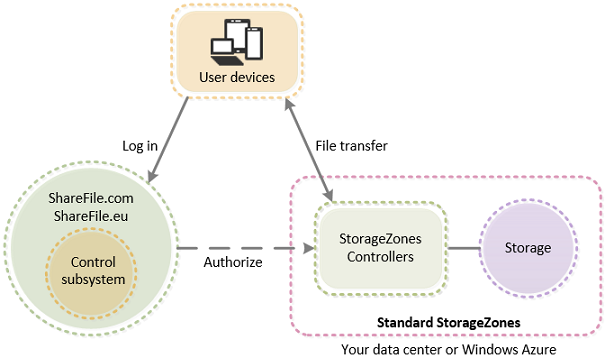

# Deploying an On-Premises StorageZone

## Introduction

ShareFile is a file sync and share collaboration platform that leverages a multi-component architecure to offer customers flexibility in where they maintain their data and the types of data which may be accessed.

Customers have the option of maintaining their ShareFile Data repository in Citrix-managed cloud storage, customer managed cloud storage (Azure, Amazon, and other S3 sources), and on-premises in customer hosted data centers.

This lab is intended to provide hands on experience deploying a Citrix ShareFile StorageZone on-premises.

## ShareFile Architecture

ShareFile architecture consists of 3 main components: The "User devices" or Client endpoints, the ShareFile Control Plane, and the Storage Tier

**Client Endpoints:** Users interact with ShareFile through one of the ShareFile Clients. Clients make API requests to the ShareFile Control Plane to interact with data. File transfers occur directly between the client and the StorageZone.

**ShareFile Control Plane:** Consists of a number of components including the ShareFile Application, Databases and the ShareFile API.

**StorageZone:** A StorageZone consists of two main components: The StorageZone Controller is hosted on a web server, and the ShareFile Data repository, a file share where the configuration and raw customer data is maintained.

For more detailed guidance on deploying an on-premises StorageZone please 

## Lab Overview

This lab consist of three moduels where you will install and configure a StorageZones Controller, configure a NetScaler to secure ShareFile traffic and then setup and use your StorageZone Controller in practice to access on-premises ShareFile Data and Connectors.

## Environment Detials

### Enroll

1. Go to events.citrixvirtualclassroom.com

2. Enter user email

3. Click enroll in class

4. Enter the enrollment code you receive in email

5. Click Provision lab

### ShareFile Account Credentails

**ShareFile Account:** 

> https://student-#.sharefile.com 

> Username: SFLabs@sharefiledemo.com

> Password: Citrix123

###NetScaler
> NetScaler
> http://192.168.10.100

> Username: nsroot

> Password: nsroot

### Domain Accounts
> Domain: training.lab
> 
> Username: Training\Administrator
> 
> Username: Training\User1
> 
> Username: Training\User2
> 
> Password: Citrix123

### StorageZone Config Information
 
> Content Switching VIP - 192.168.10.92
> 
> StorageZones Controller - SFILE1 - 192.168.10.105

> AAA vServer - 192.168.10.40

> LDAP Server - AD - 192.168.10.11

## Table of Contents

1. Introduction: Deploying an on-premises StorageZones Controller
2. [Module 1: Installing and Configuring an on-premises ShareFile StorageZone](/Module-1)
3. [Module 2: Configuring NetScaler for an on-premises ShareFile StorageZone](/Module-2)
4. [Module 3: Using your on-premises StorageZone](/Module-3)